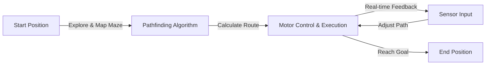
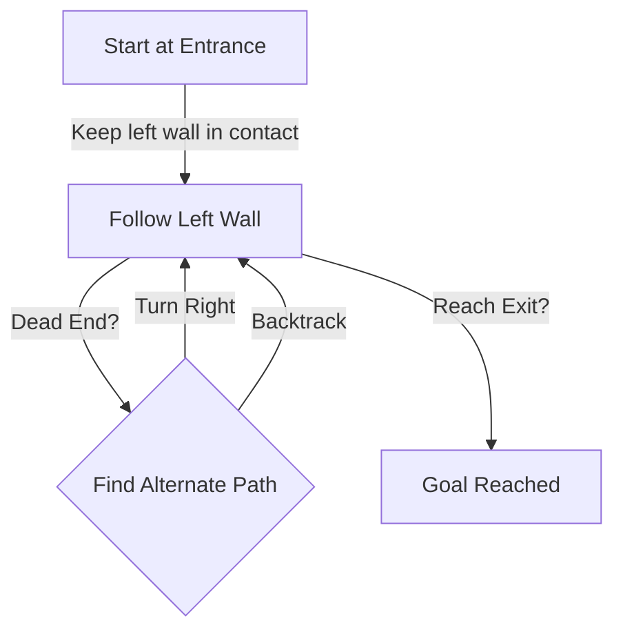

# Robot Maze Controller

An autonomous robot system that navigates and solves mazes through sensor-based pathfinding and real-time motor control. This project demonstrates embedded systems design, sensor integration, algorithm implementation, and hardware-software co-design across multiple coursework iterations.

<p align="center">
  
  
  
  
  
</p>

---

## Overview

This coursework project spans two iterations, each building on the previous to create an increasingly sophisticated maze-solving robot. The system combines embedded C/C++ firmware, real-time sensor processing, pathfinding algorithms, and motor control to autonomously explore and navigate maze environments.

The robot uses distance sensors (ultrasonic and/or infrared) to detect walls and obstacles in real time, applies a maze-solving strategy (such as the left-hand rule or wall-following), and uses differential motor control to navigate from start to goal.



## Project Structure

```
Robot-Maze-Controller/
├── Coursework 1/          # Initial implementation and exploration
│   ├── [Firmware & Config]
│   └── [Design Documentation]
├── Coursework 2/          # Enhanced algorithm and hardware refinement
│   ├── [Optimized Firmware]
│   ├── [Sensor Tuning]
│   └── [Advanced Features]
└── Professor Feedback/    # Feedback and assessment documents
```

### Coursework 1: Foundation & Exploration

**Scope:** Build a basic maze-solving robot with core functionality.

**Key Components:**
- Microcontroller (Arduino or STM32) as the brain
- Multiple distance sensors for environmental awareness
- Motor drivers and actuators for movement
- Line-following or wall-following algorithm
- Simple maze mapping and decision logic

**Learning Objectives:**
- Embedded systems programming and hardware interfacing
- Sensor calibration and real-time data processing
- Motor control and motion planning
- Basic algorithm design for maze solving

### Coursework 2: Refinement & Advanced Features

**Scope:** Optimize performance, add sophisticated features, and handle edge cases.

**Improvements Over CW1:**
- Refined pathfinding (e.g., shortest path detection, loop avoidance)
- Better sensor accuracy and noise filtering
- Faster maze traversal through path optimization
- Possibly: multi-strategy switching, logging, or remote monitoring
- Enhanced code modularity and robustness

**Additional Learning:**
- Performance optimization and real-time constraints
- Sensor fusion and uncertainty handling
- Code refactoring for maintainability

---

## Hardware Architecture

### Core Components

| Component | Role |
|-----------|------|
| **Microcontroller** | Brain: runs firmware, coordinates all systems |
| **Distance Sensors** | Eyes: detect walls/obstacles via ultrasonic echo or IR reflection |
| **DC Motors & Wheels** | Locomotion: differential drive for forward/turn motion |
| **Motor Driver** | Power bridge: amplifies microcontroller signals to drive motors |
| **Power Supply** | Battery or USB: powers all components |

### Sensor Types Commonly Used

**Ultrasonic Sensors** (HC-SR04, etc.)
- Measure distance by sending sound pulses and timing echo
- Effective range: typically 2 cm – 4 m
- Good for detecting walls in a maze

**Infrared Sensors** (Line-following or proximity)
- Detect reflected IR light from surfaces
- Used for line-following or obstacle proximity
- Lower power draw, faster response

### Motor Configuration

**Differential Drive** (two independent wheels)
- Left wheel + right wheel speed control = forward/turn/spin
- Enables flexible 2D navigation
- Common on small maze robots

**Sample Control Logic:**
```
Forward:     left_speed > 0,  right_speed > 0
Turn Left:   left_speed = 0,  right_speed > 0  (or reverse left)
Turn Right:  left_speed > 0,  right_speed = 0  (or reverse right)
Spin/Pivot:  left_speed > 0,  right_speed < 0
```

---

## Maze-Solving Algorithms

### Left-Hand Rule (Wall Following)

The robot follows the wall on its left side, keeping its left hand in contact with the wall. This guarantees reaching the exit in a simply connected maze.



**Pseudocode:**
```
while not_at_goal:
    if left_is_open:
        turn_left_and_move()
    elif front_is_open:
        move_forward()
    elif right_is_open:
        turn_right_and_move()
    else:
        turn_around()  # Dead end
```

### Alternative Strategies

**Right-Hand Rule** — Mirror of left-hand rule; follow the wall on the right.

**Shortest Path / Exploration** — Map the entire maze first, then compute the optimal route using BFS or Dijkstra's algorithm.

**Adaptive Pathfinding** — Switch strategies based on maze complexity or dynamic obstacles.

---

## Motion Control & Sensor Feedback Loop

### Real-Time Loop

```
1. Read Sensors
   └─ Distance from front, left, right ultrasonic sensors
   └─ IR sensor readings (if line-following)
   └─ Any other inputs (buttons, compass, etc.)

2. Process & Decide
   └─ Apply maze-solving algorithm
   └─ Determine next move (forward, left, right, stop)
   └─ Calculate motor speeds

3. Execute
   └─ Write PWM signals to motor driver
   └─ Actuate left & right wheels

4. Delay & Repeat
   └─ Brief pause for system response time (~50–100 ms typical)
   └─ Loop back to Step 1
```

### PID Control (Optional Enhancement)

For smooth, stable motion, a PID controller can adjust motor speeds in real time to maintain desired velocity or heading:

```c
// Pseudocode: Simple speed control
error = target_speed - current_speed;
correction = Kp * error + Ki * integral_error + Kd * derivative_error;
actual_motor_speed = base_speed + correction;
```

---

## Building & Deployment

### Prerequisites

- **IDE:** Arduino IDE, STM32CubeIDE, or equivalent
- **Compiler:** gcc-arm-embedded or Arduino toolchain
- **Libraries:**
  - Servo/PWM libraries for motor control
  - Sensor interface libraries (if provided)
  - UART/Serial for debugging (optional)
- **Hardware:** Programmed microcontroller, sensors, motors, power supply assembled

### Compilation (Example: Arduino)

```bash
# Command-line build (using Arduino CLI)
arduino-cli compile --fqbn arduino:avr:uno YourSketchFolder/

# Or upload directly
arduino-cli upload -p /dev/ttyUSB0 --fqbn arduino:avr:uno YourSketchFolder/
```

### Compilation (Example: STM32)

```bash
# Using STM32CubeIDE or CMake
mkdir build && cd build
cmake ..
make
# Load firmware onto board via USB or JTAG
```

### Running the Robot

1. **Calibrate Sensors**
   - Test ultrasonic/IR readings in free space and near walls
   - Adjust thresholds if needed (e.g., `WALL_DISTANCE_THRESHOLD`)

2. **Test Motor Response**
   - Verify forward/backward/turn commands move the robot as expected
   - Ensure differential drive is balanced (left and right wheels turn at similar speeds)

3. **Set Up Maze**
   - Place robot at the start of the maze
   - Ensure clear line of sight for sensors

4. **Run the Algorithm**
   - Power on the robot or upload firmware via USB
   - Robot should autonomously navigate the maze
   - Observe behavior and debug as needed

---

## Code Structure (Typical Firmware)

```c
// main.c (pseudocode)

#include <stdio.h>
#include <stdlib.h>
#include "motor.h"
#include "sensor.h"
#include "maze.h"

volatile int left_distance, right_distance, front_distance;

void read_sensors() {
    left_distance = measure_ultrasonic(LEFT_PIN);
    front_distance = measure_ultrasonic(FRONT_PIN);
    right_distance = measure_ultrasonic(RIGHT_PIN);
}

void maze_solve() {
    while (!reached_goal()) {
        read_sensors();
        
        // Apply left-hand rule or custom logic
        if (left_distance > THRESHOLD) {
            // Wall is far; turn left to follow it
            motor_turn_left();
        } else if (front_distance > THRESHOLD) {
            // Path ahead is clear
            motor_forward();
        } else if (right_distance > THRESHOLD) {
            // Must turn right
            motor_turn_right();
        } else {
            // Dead end; back up or stop
            motor_reverse();
        }
        
        delay(100);  // Allow time for motion
    }
    motor_stop();
}

int main() {
    init_motors();
    init_sensors();
    
    maze_solve();
    
    return 0;
}
```

### Key Files (Expected in Repository)

| File | Purpose |
|------|---------|
| `main.c` / `main.ino` | Entry point; main control loop |
| `motor.h / motor.c` | Motor initialization, speed control, PWM |
| `sensor.h / sensor.c` | Sensor reading, calibration, filtering |
| `maze.h / maze.c` | Maze-solving algorithm logic |
| `config.h` | Tunable parameters (thresholds, speeds, etc.) |
| `Makefile` / `.ino` build files | Build instructions |

---

## Troubleshooting & Common Issues

### Robot Moves in Circles
- **Cause:** Unbalanced motor speeds or misaligned wheels
- **Fix:** Adjust PWM values for left/right motors to be equal; check wheel alignment

### Sensors Not Reading Correctly
- **Cause:** Poor wiring, faulty sensors, or interference
- **Fix:** Verify connections; test sensors independently; add shielding if needed; recalibrate thresholds

### Robot Gets Stuck in Loops
- **Cause:** Maze-solving algorithm doesn't handle complex paths
- **Fix:** Add loop detection (mark visited cells); switch to shortest-path algorithm; improve sensor accuracy

### Erratic Behavior
- **Cause:** Noisy sensor data, power supply fluctuations, or slow loop frequency
- **Fix:** Add low-pass filtering to sensor readings; stabilize power; increase loop speed; use PID control

### Motor Driver Overheating
- **Cause:** Excessive current draw or prolonged high-speed operation
- **Fix:** Reduce speed; check for stalled motors; ensure adequate cooling or shorter duty cycles

---

## Repository Contents

| Folder | Contents |
|--------|----------|
| **Coursework 1** | Initial firmware, basic sensor integration, simple maze solver |
| **Coursework 2** | Refined firmware, optimized pathfinding, enhanced robustness |
| **Professor Feedback** | Instructor comments, grading rubrics, improvement suggestions |

---

## Performance Metrics

Typical goals for a maze-solving robot:

- **Maze Navigation Time:** Complete a standard maze in < 30 seconds (varies by maze size)
- **Accuracy:** Reach the goal 9 out of 10 times without human intervention
- **Sensor Responsiveness:** Real-time decisions within 50–200 ms
- **Code Efficiency:** Firmware size < 30 KB; RAM usage < 2 KB (Arduino-class devices)

---

## Learning Outcomes

Upon completing this project, you will understand:

✓ **Embedded Systems**: Microcontroller programming, hardware interfacing, real-time constraints  
✓ **Sensor Integration**: Calibration, noise filtering, multi-sensor fusion  
✓ **Motor Control**: PWM, differential drive, motion planning  
✓ **Algorithm Design**: Maze-solving strategies, pathfinding, decision-making logic  
✓ **Debugging**: Testing on real hardware, handling edge cases, optimization  
✓ **Systems Integration**: Coordinating firmware, hardware, and physical mechanics  

---

## Ideas for Extension

- **Shortest Path Optimization:** Use BFS/Dijkstra instead of wall-following for guaranteed shortest route
- **Autonomous Mapping:** Create a live map of the maze as the robot explores
- **Remote Control:** Add Bluetooth or RF module for manual control or telemetry monitoring
- **Speed Optimization:** Implement PID control for stable, high-speed navigation
- **Multi-Robot Coordination:** Have multiple robots solve the same maze collaboratively
- **Obstacle Avoidance:** Detect and navigate around dynamic obstacles
- **Visual Markers:** Recognize colored zones, signs, or QR codes within the maze
- **Energy Efficiency:** Minimize power consumption for longer battery runtime
- **Simulation:** Build a software simulator to test algorithms before hardware deployment

---

## References & Resources

- **Arduino Resources:**
  - [Arduino Official Documentation](https://www.arduino.cc/en/Documentation)
  - [Motor Control with Arduino](https://www.arduino.cc/en/Tutorial/MotorControl)

- **STM32 Resources:**
  - [STM32CubeIDE](https://www.st.com/en/development-tools/stm32cubeide.html)
  - [STM32 HAL Libraries](https://www.st.com/en/microcontrollers/stm32-32-bit-arm-cortex-mcus.html)

- **Sensor Datasheets:**
  - HC-SR04 Ultrasonic Sensor
  - IR Sensor Modules (GP2Y0A21YK0F, etc.)
  - Motor Driver ICs (L293D, DRV8835, etc.)

- **Algorithm References:**
  - [Maze Solving Algorithms](https://en.wikipedia.org/wiki/Maze_solving_algorithm)
  - [BFS for Shortest Path](https://en.wikipedia.org/wiki/Breadth-first_search)
  - [PID Control Tutorial](https://en.wikipedia.org/wiki/PID_controller)

---

## License

This project is part of university coursework at the University of Warwick and provided for educational purposes.

---

## Feedback & Iteration

Both coursework iterations document the design evolution, refinement decisions, and lessons learned. Professor feedback provides guidance on:
- Code quality and architecture
- Algorithm efficiency and correctness
- Hardware integration and robustness
- Documentation and communication

Review the feedback documents to understand what worked well and where improvements were made between CW1 and CW2.

